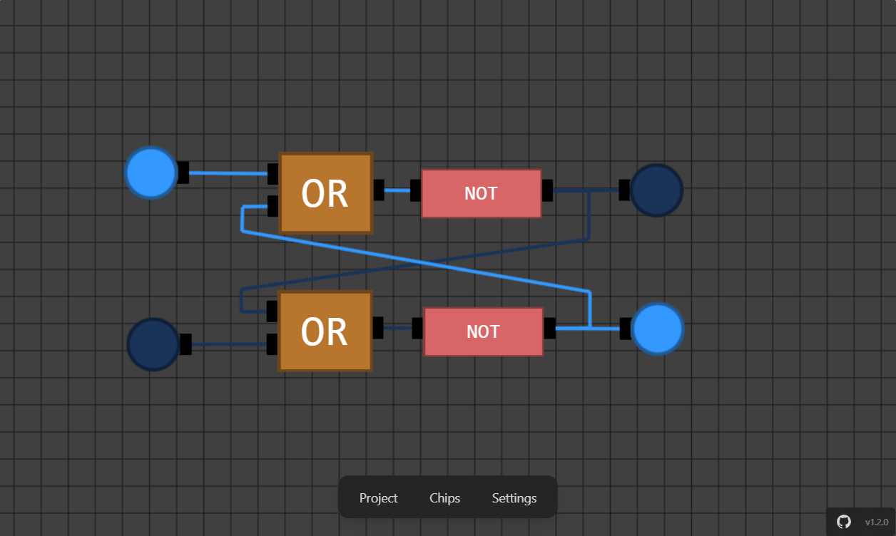

# ⚡️ Flux

A fast, playful digital-circuit sandbox.

Visually build logic circuits, compose custom chips, and experiment freely in real time. Save your designs as blueprints, share them with friends, or grow your own library of reusable components.

Built for tinkering, learning, and rapid iteration.

<p align="center">
    
</p>

## 🚀 Live demo

http://hasnainroopawalla.github.io/flux

## 🛠️ Quick Start

### Tech Stack

- TypeScript
- React + Vite + Tailwind CSS
- WebGPU (custom render engine)

### Instructions

1. Install dependencies (requires `pnpm`):

```bash
pnpm install
```

2. Run the app:

```bash
pnpm start
```

## 📦 Blueprints

Looking for inspiration?
Check out the [/blueprints](https://github.com/hasnainroopawalla/flux/tree/master/packages/simulator/src/blueprints) directory to explore a growing collection of prebuilt circuits—from simple logic gates to more complex compositions.

You can load these blueprints directly into the simulator, modify them, or use them as a starting point for your own designs.

## 🧩 Contributing

- Found a bug or have a feature idea? Open an issue on GitHub: https://github.com/hasnainroopawalla/flux/issues
- To contribute: fork, make changes on a branch, and open a pull request against `master`.

## 📄 License

- This project is licensed under the MIT License — see the LICENSE file for details.
