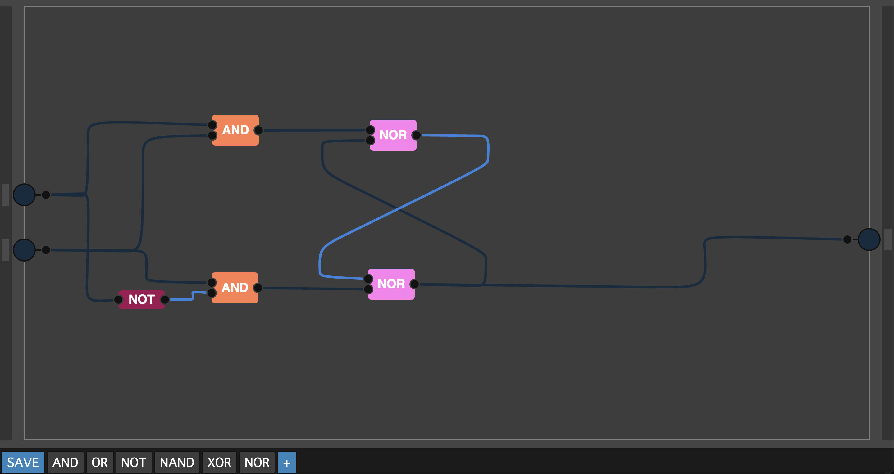
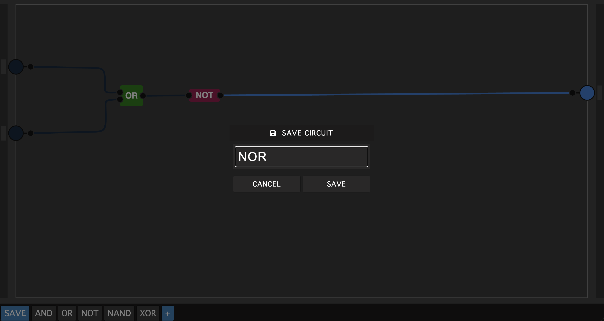
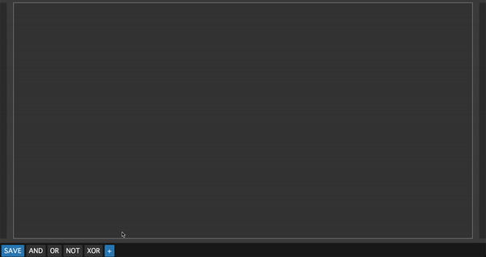

# Circuit Sim

[Live Demo](http://hasnainroopawalla.github.io/circuit-sim)

A digital circuit simulator build using React, TypeScript and P5.js.

#### Data-latch circuit
<p align="center">
    
</p>

#### Save circuit
<p align="center">
    
</p>

#### Import chip
<p align="center">
    
</p>

## Features
- Sandbox environment for digital chips
- Save the current circuit as a custom chip
- Import chips using blueprint strings. Example:
    - blueprint string for the `NAND` custom chip
      ```
      {"main":{"inputs":[{"id":"chip.input.0"},{"id":"chip.input.1"}],"outputs":[{"id":"chip.output.2"}],"chips":[{"id":"chip.AND.3","name":"AND"},{"id":"chip.NOT.4","name":"NOT"}],"wires":[["chip.input.0/output.0","chip.AND.3/input.0"],["chip.input.1/output.0","chip.AND.3/input.1"],["chip.AND.3/output.0","chip.NOT.4/input.0"],["chip.NOT.4/output.0","chip.output.2/input.0"]]}}
      ```

## Contributing
- Post any issues or suggestions on the GitHub [issues](https://github.com/hasnainroopawalla/circuit-sim/issues) page.
- To contribute, fork the project and then create a pull request back to `master`.

## License
This project is licensed under the MIT License - see the [LICENSE](https://github.com/hasnainroopawalla/circuit-sim/blob/4e430c15e967846c1117ecc3e1cb5b74095e870a/LICENSE) file for details.
